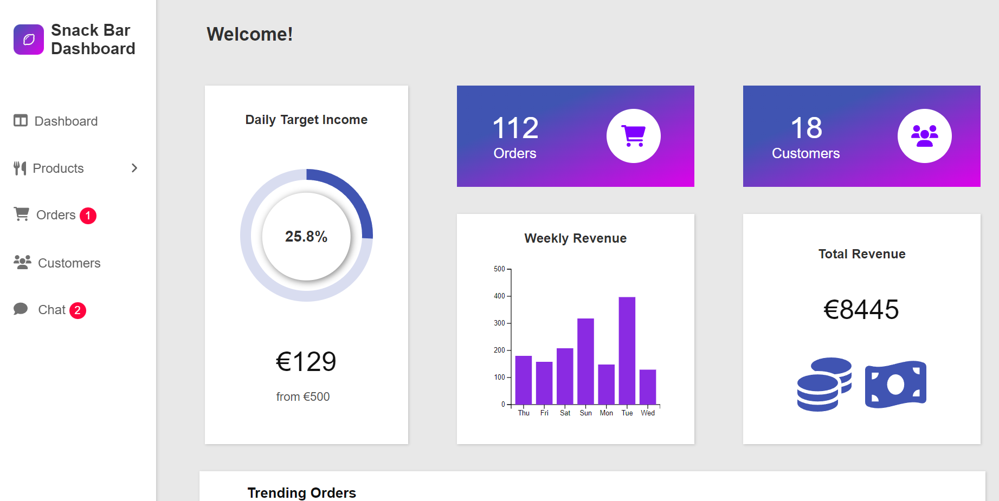

# Food Order App- Admin Dashboard

[View Live Webapp](https://6378372e9d407f764d34917b--subtle-nasturtium-5d32c7.netlify.app/#/)

## Description

&nbsp;&nbsp;&nbsp;&nbsp;This is the admin dashboard where you can manage the [Food order app](https://courageous-frangipane-c90c9e.netlify.app/) that I created. These 2 apps can communicate 
with each other, to carry out specific tasks. They are both connected to an 
[HTTP server](https://github.com/Aris-Empanta/restaurant-server) that I built with Node js, Express, Socket.io and MySql.

&nbsp;&nbsp;&nbsp;&nbsp;&nbsp;Consider this one as the app that is
 used by the restaurant owner, who can check the orders and live chat messages of the customer, manage the products, and execute several
other operations explained in further detail below: 

## Dashboard Sections

### Front Dashboard

&nbsp;&nbsp;&nbsp;&nbsp;This is the front section, where you can see 
the statistics of the restaurants revenues, customers and the most trending orders.

### Products

&nbsp;&nbsp;&nbsp;&nbsp;Here you can add new products. You can also 
check all the existing products separated by category, edit or delete them, 
depending your needs. A complete CRUD operation.

### Orders

&nbsp;&nbsp;&nbsp;&nbsp;In the orders section, you can check all the orders been made.
Once you receive a new order, the list is updated in real time with the
help of socket.io library, with a sound notification sounding and an indication
in navbar with the number of the unchecked new orders.

### Orders

&nbsp;&nbsp;&nbsp;&nbsp;The section with all the registered customers. It shows
all the details of any customer that chose to save his information in the 
form that he filled up in Food Order App.

### Chat

&nbsp;&nbsp;&nbsp;&nbsp;This is the Live Chat section. The customer can
send a message in real time to the admin, with the help of socket.io library.
The messages are also save with the help of the HTTP server and MySql database.
Just like the orders, once you receive a new message a notification sounds, and the 
indication of all unread messages appears in the navbar and on all conversations 
separately. The admin can delete any conversation selected, or 
mark it as unread.